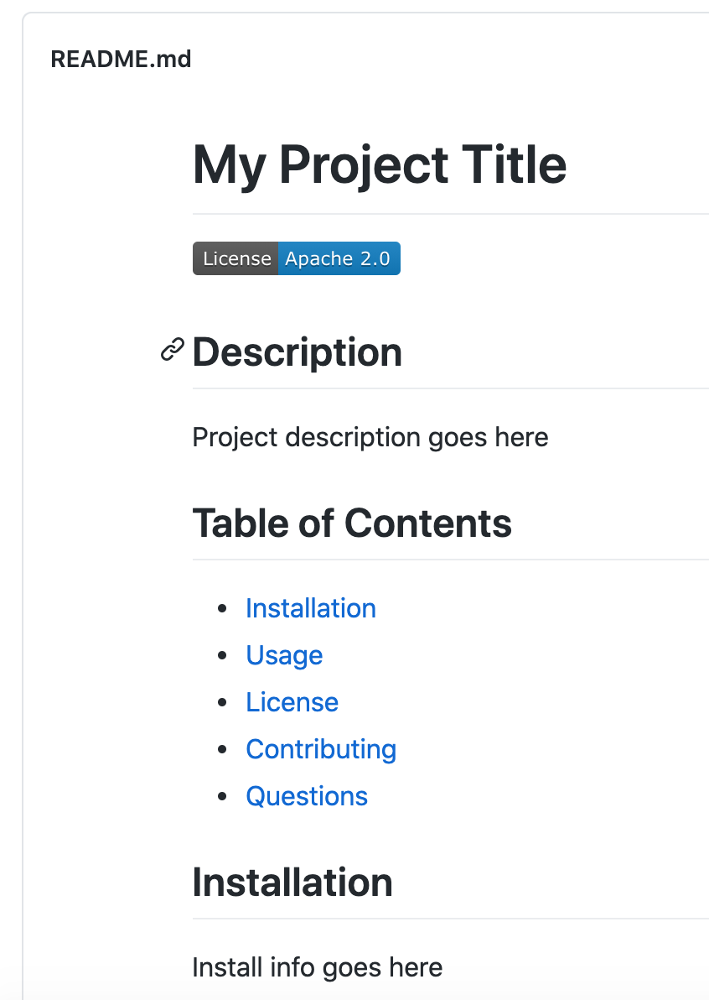

# lauramichellepeterson.github.io-challenge9
https://github.com/lauramichellepeterson/lauramichellepeterson.github.io-challenge9

## Description
This application allows the user to create a custom README.md file via command line inputs.
After answering the prompts, the file will be created here: ./dist/README.md
An example can be found at that location in this repo.

## Screenshot
Here is an example of a README.md generated using this application

## Walkthrough

## Contact Me
https://github.com/lauramichellepeterson
